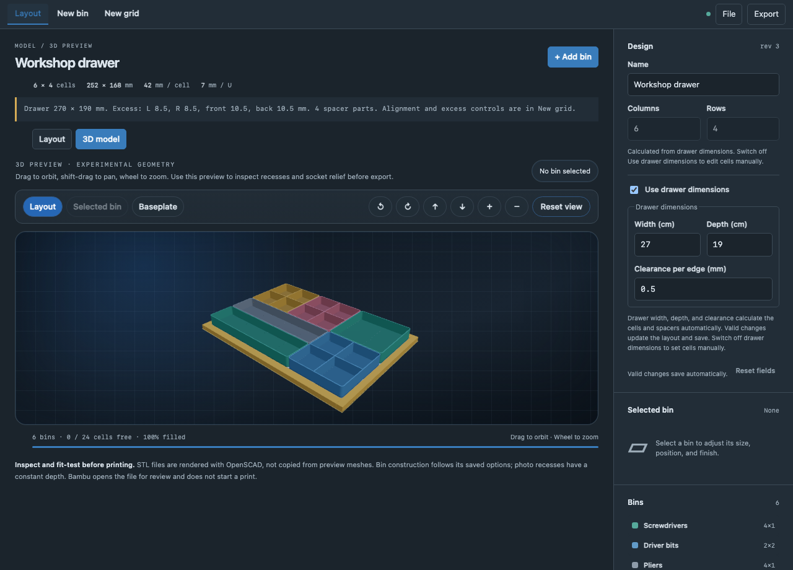
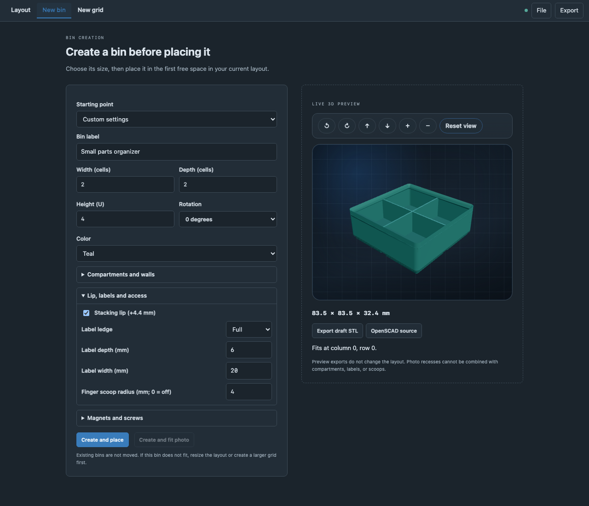
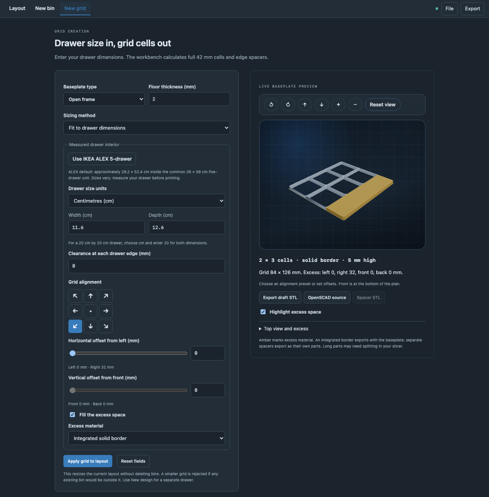

# Gridfinity Builder

[](https://github.com/JasonEtco/gridfinity-copilot-extension/actions/workflows/test.yml)
[](LICENSE)

A local Copilot canvas for designing Gridfinity drawer layouts, bins, and
baseplates. Preview in 3D, fit recesses from photos, and export STL files or
open them in Bambu Studio.



## Install

Requires a Copilot app/CLI with **extension canvases**. Ask Copilot:

```text
Install this canvas extension for my user:
https://github.com/JasonEtco/gridfinity-copilot-extension/tree/main/.github/extensions/gridfinity-builder
```

Then ask: **"Open Gridfinity Builder for design `tool-drawer`."**

No npm install or API keys are needed. For a manual install, copy the whole
`.github/extensions/gridfinity-builder/` folder to
`~/.copilot/extensions/gridfinity-builder/` and reload extensions.
See the [installation guide](docs/guide.md#install) for project scope and custom paths.

## Three ways to build

| Tab | What you can do |
|---|---|
| **Layout** | Arrange, rotate, and duplicate bins. Enter drawer dimensions in cm or mm to calculate cells and spacers. Valid inspector edits save automatically. |
| **New bin** | Configure walls, compartments, stacking lips, labels, scoops, and mounting holes with a live 3D preview. Trace a photo to make an item-shaped recess. |
| **New grid** | Choose a solid floor or open frame, align the grid, and fill excess space with separate spacers or an integrated border. |

Cells keep the standard **42 mm pitch** and **7 mm height units**. New designs
start with an IKEA ALEX preset; measure your drawer before printing.
You can also ask Copilot in chat to edit the canvas through its actions.

### Bin generator



### Baseplate generator



## Export and save

The **Export** menu follows the active tab. Export just a bin or grid draft
without adding it to the layout, or choose saved parts from **Layout**.

- **STL:** requires [OpenSCAD](https://openscad.org/downloads.html).
- **Open in Bambu:** also requires [Bambu Studio](https://bambulab.com/download/studio).
  Opens a local file for review; it does not start a print.
- **OpenSCAD and JSON:** editable source and portable layout backups.

Designs and reference photos save outside the repo in
`$COPILOT_HOME/extensions/gridfinity-builder/artifacts/`
(`COPILOT_HOME` defaults to `~/.copilot`). JSON backups can include photos.

**Inspect exports and print a fit sample first.** Photo recesses use a measured
2D outline and constant depth, not a 3D scan. Large parts may need splitting
in your slicer. See [fabrication limits](docs/guide.md#fabrication-exports-and-limits).

## Development

Use Node.js 22 or 24:

```sh
npm ci
npm test
npm run build:vendor
```

[User guide and canvas actions](docs/guide.md) ·
[Contributing](CONTRIBUTING.md) · [Security](SECURITY.md)

## License

[MIT](LICENSE), with [third-party notices](.github/extensions/gridfinity-builder/THIRD_PARTY_NOTICES.md).
An independent tool for Zack Freedman's Gridfinity system; not an official
Gridfinity or GitHub product.
